I had a lot of stars.
Now I don't

# Selección de librerías favoritas para Android

## Índice
* [Herramientas](sections/herramientas.md)
* [Menú](sections/menu.md)
* [Lista](sections/lista.md)
* [Botones](sections/botones.md)
* [Texto](sections/texto.md)
* [Animaciones](sections/animaciones.md)
* [Navegación](sections/navegacion.md)
* [Diálogos](sections/dialogos.md)
* [Layout](sections/layout.md)
* [Otros](sections/otros.md)

### Herramientas
Repositorio | Descripción
-|-
[Picasso](https://github.com/square/picasso) | Manejo de imágenes
[Glide](https://github.com/bumptech/glide) | Manejo de imágenes
[Fotoapparat](https://github.com/Fotoapparat/Fotoapparat) | API de cámara
[EventBus](https://github.com/greenrobot/EventBus) | Comunicación asíncrona entre un publicador y sus suscriptores
[Easypermissions](https://github.com/googlesamples/easypermissions) | Manejo de permisos simplificado
[PermissionsDispatcher](https://github.com/permissions-dispatcher/PermissionsDispatcher) | Manejo de permisos simplificado
[Calligraphy](https://github.com/chrisjenx/Calligraphy) | Fuente de texto personalizada para la aplicación
[Guava](https://github.com/google/guava) | Set de librerías con tipos, colecciones, métodos, etc.
[Zxing](https://github.com/zxing/zxing) | Escáner de QR y códigos de barra
[AndroidPdfViewer](https://github.com/barteksc/AndroidPdfViewer) | Lector de PDF
[Gson](https://github.com/google/gson) | Manejo JSON-POJO

### Menú
Repositorio | Descripción | Captura
-|-|-
[SwipeMenuDemo](https://github.com/Brioal/SwipeMenuDemo) | Menú lateral tipo Drawer | 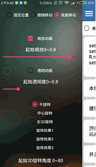
[DropDownMenu](https://github.com/fg2q1q3q/DropDownMenu) | Menú desplegable | 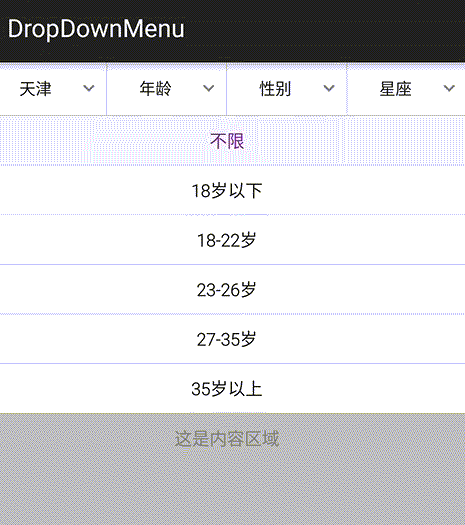
[DropdownMenu](https://github.com/twiceyuan/DropdownMenu) | Menú desplegable | 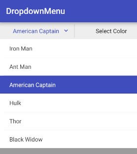
[CycleMenu](https://github.com/Cleveroad/CycleMenu) | Menú circular con animación | 
[FABRevealMenu-master](https://github.com/HarinTrivedi/FABRevealMenu-master) | FAB Menú cuadrado | 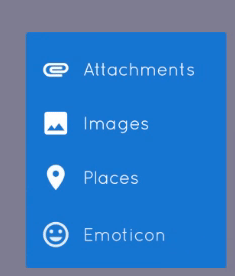

### Lista
Repositorio | Descripción | Captura
-|-|-
[CardSwipeLayout](https://github.com/yuqirong/CardSwipeLayout) | Swipe de cartas tipo Tinder | 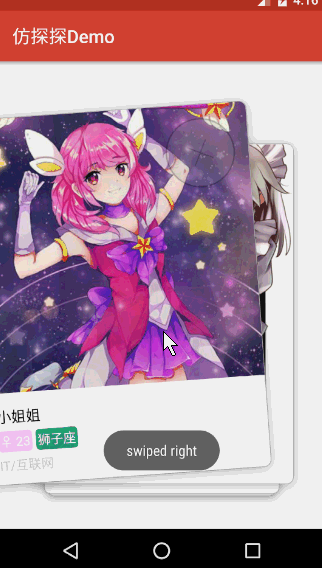
[SwipeCardView](https://github.com/xiepeijie/SwipeCardView) | Swipe de cartas tipo Tinder | 
[StackCardsView](https://github.com/wensefu/StackCardsView) | Swipe de cartas tipo Tinder | 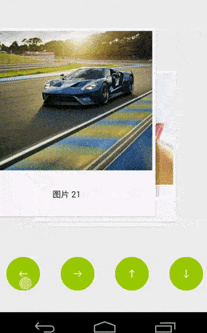
[WheelView-3d](https://github.com/youxiaochen/WheelView-3d) | Rueda de selección, vertical y horizontal | 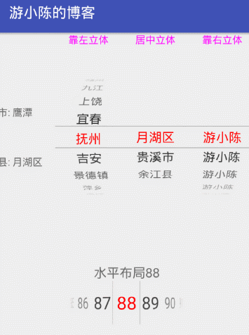
[FanLayoutManager](https://github.com/Cleveroad/FanLayoutManager) | Lista en abanico | 
[SmartRefreshLayout](https://github.com/scwang90/SmartRefreshLayout) | Recopilación de elementos para refrescar listas | 
[AndroidPileLayout](https://github.com/xmuSistone/AndroidPileLayout) | Lista en forma de pila | 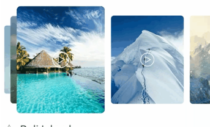
[CarouselLayoutManager](https://github.com/Azoft/CarouselLayoutManager) | Carrusel de imágenes con tamaño por proximidad | 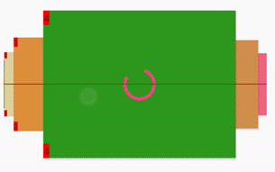

### Botones
Repositorio | Descripción | Captura
-|-|-
[SwitchButton](https://github.com/KingJA/SwitchButton) | Botones tipo switch | 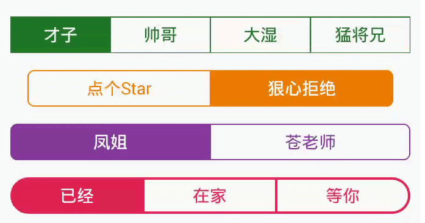
[proSwipeButton](https://github.com/shadowfaxtech/proSwipeButton) | Botón de swipe | 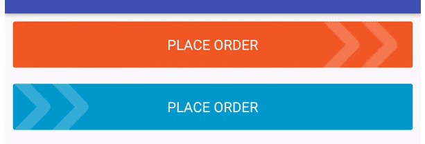

### Texto
Repositorio | Descripción | Captura
-|-|-
[EdgeTranslucent](https://github.com/qinci/EdgeTranslucent) | Texto con difuminaciones en scroll | 
[FillBlankView](https://github.com/woxingxiao/FillBlankView) | Cajas de texto para rellenar (también para pin) | 
[material-code-input](https://github.com/bajian/material-code-input) | Cajas de texto para rellenar (también para pin) | 

### Animaciones
Repositorio | Descripción | Captura
-|-|-
[AVLoadingIndicatorView](https://github.com/81813780/AVLoadingIndicatorView) | Componente de animación indefinidas | 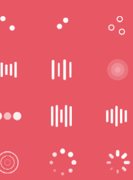
[AndroidViewAnimations](https://github.com/daimajia/AndroidViewAnimations) | Animaciones para componentes | 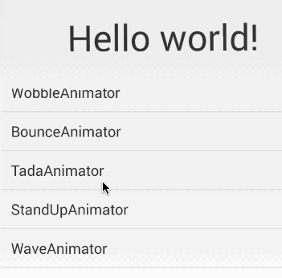

### Navegación
Repositorio | Descripción | Captura
-|-|-
[Android-TabView](https://github.com/yaochangliang159/Android-TabView) | Tabs simples para zona superior e inferior, y a los lados verticalmente | 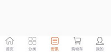
[MaterialDrawer](https://github.com/mikepenz/MaterialDrawer) | NavigationDrawer estilo Material | 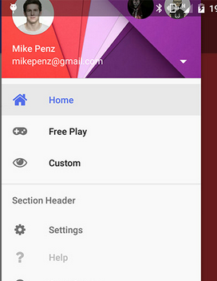
[NavigationTabBar](https://github.com/Devlight/NavigationTabBar) | BottomBar personalizable | 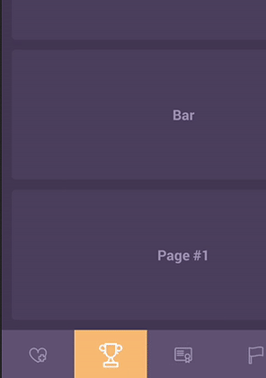

### Diálogos
Repositorio | Descripción | Captura
-|-|-
[android-betterpickers](https://github.com/code-troopers/android-betterpickers) | Múltiples diálogos simples | 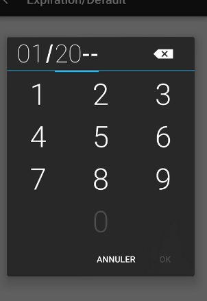
[Two-Step-Picker-Dialog](https://github.com/aliab/Two-Step-Picker-Dialog) | Diálogo por pasos | 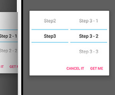
[BottomSheetBuilder](https://github.com/rubensousa/BottomSheetBuilder) | Diálogo en estilo de hoja en posiciones variables | 
[dialogplus](https://github.com/orhanobut/dialogplus) | Diálogo estático personalizable | 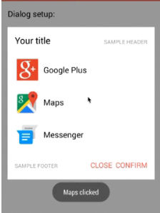
[Android-FloatingTutorialActivity](https://github.com/klinker24/Android-FloatingTutorialActivity) | Diálogo simple a modo tutorial | 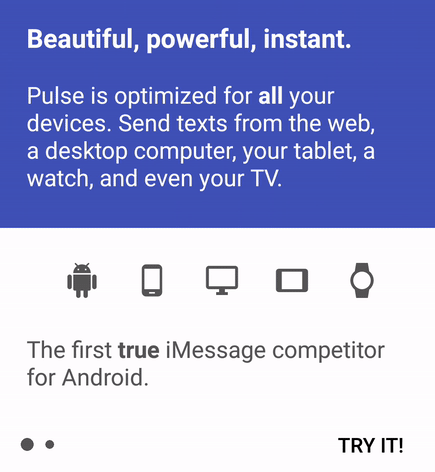

### Layout
Repositorio | Descripción | Captura
-|-|-
[flexbox-layout](https://github.com/google/flexbox-layout) | Layout estilo Flexbox de CSS | 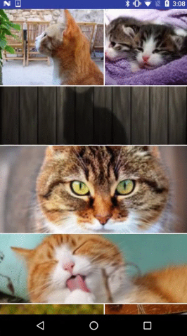
[FrescoImageViewer](https://github.com/stfalcon-studio/FrescoImageViewer) | Componente para imágenes con zoom | 
[SpannedGridLayoutManager](https://github.com/Arasthel/SpannedGridLayoutManager) | Grid de vistas expandibles | 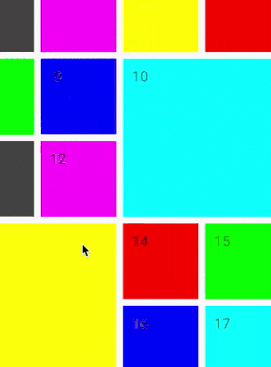

### Otros
Repositorio | Descripción | Captura
-|-|-
[banner](https://github.com/youth5201314/banner) | Banner de imágenes tipo anuncio | 
[VerticalBannerView](https://github.com/guojunustb/VerticalBannerView) | Banner automático vertical | 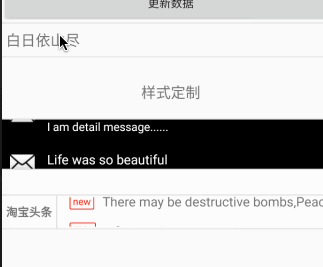
[Leku](https://github.com/SchibstedSpain/Leku) | Puntero de mapa | 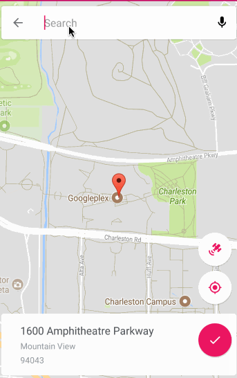
[Squint](https://github.com/IntruderShanky/Squint) | Corte diagonal para vista | 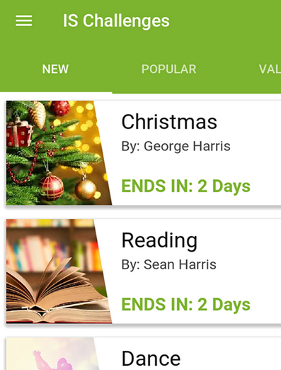
[BubbleTextView](https://github.com/dupengtao/BubbleTextView) | Alerta de texto sobre vistas | 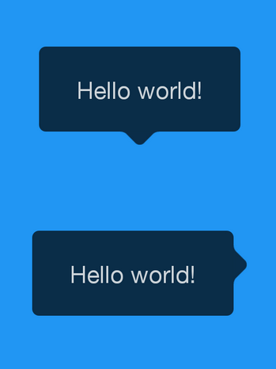
[AchievementView](https://github.com/RafaelBarbosatec/AchievementView) | Toast con animación de logro | 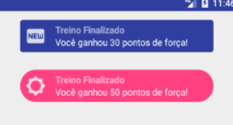
[uCrop](https://github.com/Yalantis/uCrop) | Corte de imágenes | 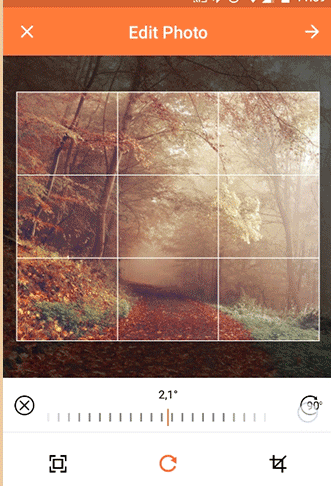
[StyleableToast](https://github.com/Muddz/StyleableToast) | Toast personalizables | 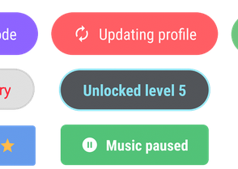
[CircleProgress](https://github.com/lzyzsd/CircleProgress) | Barra de progreso circular | 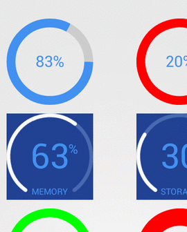
[DiscreteScrollView](https://github.com/yarolegovich/DiscreteScrollView) | Scroll horizontal | 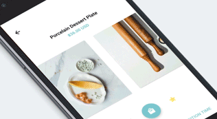
[EazeGraph](https://github.com/blackfizz/EazeGraph) | Generador de gráficos | 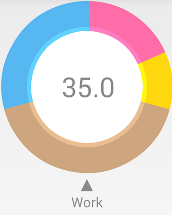
[CircleImageView](https://github.com/hdodenhof/CircleImageView) | ImageView circular | 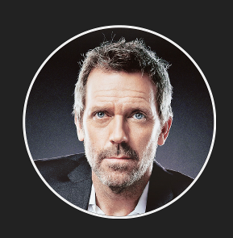
[FancyShowCaseView](https://github.com/faruktoptas/FancyShowCaseView) | Focus en vistas estilo tutorial | 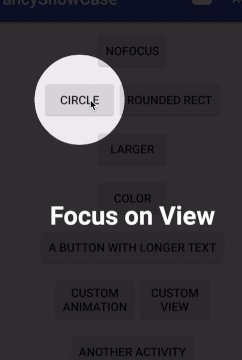
[material-intro-screen](https://github.com/TangoAgency/material-intro-screen) | Intro de aplicación Material | 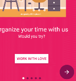
[MaterialAbout](https://github.com/jrvansuita/MaterialAbout) | Acerca de, completo | 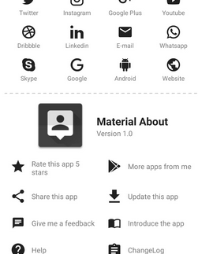
[material-about-library](https://github.com/daniel-stoneuk/material-about-library) | Acerca de, simple | 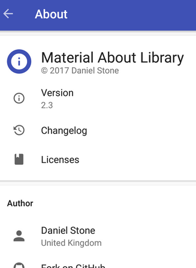
